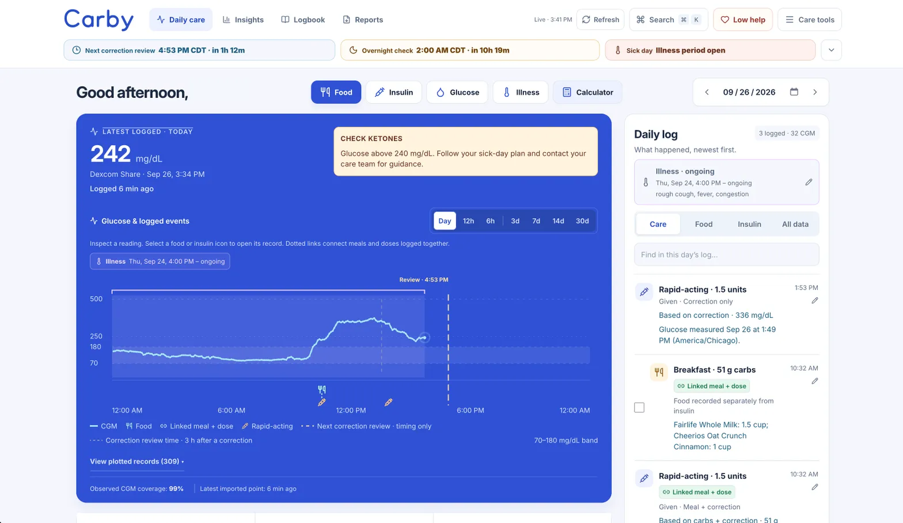

# Carby

> [!TIP]
> [Cabotage](https://preview.cabotage.io/) is the recommended way to self-host Carby. The `Dockerfile` and `Procfile` already match what it expects.

Carby is a web app for diabetes logging: glucose, food, insulin, exercise, low treatments, reminders, illness periods, appointments, a clinic-style logbook, and reports for your care team. It can pull readings from Dexcom Share and Clarity.



> [!WARNING]
> Carby is experimental and not a medical device. Nothing it shows is dosing advice; follow your glucose device and your clinician's care plan. It has had no security audit, so use synthetic data until your deployment meets [docs/hosting-migration.md](docs/hosting-migration.md).

## Run it locally

Needs Bun 1.4.2+, Node.js 22.13+, and Docker with Compose.

```sh
make serve
```

Open <http://localhost:5173>. This starts PostgreSQL in Docker, runs migrations, and signs you in to a local account. No `.env` or OAuth app needed.

| Command        | Purpose                              |
| -------------- | ------------------------------------ |
| `make serve`   | Dev server on port 5173              |
| `make build`   | Build into `dist/`                   |
| `make start`   | Serve the build on port 8787         |
| `make migrate` | Apply migrations to `DATABASE_URL`   |
| `make test`    | Run tests                            |
| `make ci`      | Lint, format check, typecheck, tests |

`make help` lists the rest. Extra options go in `ARGS`, e.g. `make serve ARGS="--port 3000"`.

- Optional settings (such as the Dexcom key): `cp -n .env.example .env`.
- If you set `DATABASE_URL` yourself, Carby never migrates it automatically. Run `make migrate` when you mean to.
- Database tests need `TEST_DATABASE_URL` pointing at a disposable Postgres. They create and drop schemas, so never use a real database or the `make serve` one.

## First run

New accounts start empty. Setup walks through your care plan one step at a time and ends with a review of every value before you save. You can import a backup instead. Carby has no clinical defaults; every value comes from your plan.

- **Required:** the glucose level you treat a low below, the level you check ketones above, and how many days in a row make a pattern.
- **Optional:** care contacts, emergency and sick-day instructions, low-treatment amount, meter HI/LO limits, and similar. Each turns on one feature. Instructions are shown exactly as you enter them. None of these changes dose calculations.
- **Time zone:** all dates and times display in the care plan's zone.

Edit these later on the care plan page (**Care tools > Care plan**, or `/plan`). It lists each section with a one-line summary and opens one section at a time. Before anything is saved, you review each changed value, old and new, and confirm it matches your clinician's instructions. **Plan history** shows what changed in each saved version.

On a wider screen, add records from the **Log** button in the bottom-right corner; on a phone, use the bar along the bottom. With a keyboard, press `?` to see every shortcut: `L` then `G` logs glucose, `G` then `I` opens Insights, and `⌘K` searches every command.

## Several people and shared care

One account can keep logs for several people, such as two children, and several accounts can share one person's log. Use the name menu at the right of the header to switch people or **Add a person**. Each person has their own care plan, time zone, saved foods, Dexcom connection and backups.

Owners open **Sharing and access** from the same menu to create a single-use invite link (valid for 7 days) and to change or remove access. The person invited signs in with their own account, which must still be allowed by `CARBY_ALLOWED_USERS` or `CARBY_ALLOWED_EMAILS`.

Everyone with access can also make **API tokens** there, under **Connected apps**, so an app can reach the person's log without signing in. A token acts as the account that made it: viewers can make read-only tokens, a token stops working when its account loses access, and changes it makes show in the history as "Mom via xDrip+". Carby shows a token once and stores only its hashes. Owners see and can revoke every token for the person.

| Role      | Can                                                                         |
| --------- | --------------------------------------------------------------------------- |
| Owner     | Everything, including the care plan, profile, Dexcom, backups and sharing.  |
| Caregiver | See everything and log care. Can't change the care plan, Dexcom or sharing. |
| Viewer    | See everything. Can't log or change anything.                               |

Every person keeps at least one owner. Changes record who made them, and sharing changes appear in the change history.

## Self-hosting

[.env.example](.env.example) documents every variable. A deployment needs:

| Variable                                       | Value                                                                          |
| ---------------------------------------------- | ------------------------------------------------------------------------------ |
| `APP_URL`                                      | Public HTTPS address                                                           |
| `DATABASE_URL`                                 | PostgreSQL connection string                                                   |
| `AUTH_SECRET`                                  | Random session secret                                                          |
| `AUTH_{GITHUB,GOOGLE,DISCORD}_{ID,SECRET}`     | At least one sign-in provider                                                  |
| `CARBY_ALLOWED_USERS` / `CARBY_ALLOWED_EMAILS` | Who may sign in (`github:12345`, or verified emails). Both empty means nobody. |

Register `https://YOUR-HOST/api/auth/callback/<provider>` with each provider. Accounts are not linked across providers.

- `release` in the `Procfile` runs migrations; `web` serves on `/var/run/cabotage/cabotage.sock`.
- Health check: `GET /_health/`.
- Secrets live in the host's secret store, not Git or the image. Changes need a restart, not a rebuild.

## Dexcom (optional)

Set `DEXCOM_SECRET_KEY` once with `openssl rand -hex 32` and never change it. It encrypts stored Dexcom logins; changing it forces everyone to reconnect.

- **Live Share:** **Care tools > Dexcom · import > Live Share**, enter a Share login. Fetches only while the app is open.
- **Clarity sync:** imports full history, fills gaps Share misses, and archives monthly PDF reports. In the Clarity phone app, go to **Profile > Authorize Sharing > Generate Code** (12 months), then paste it in **Care tools > Dexcom · import > Clarity sync**. Production syncs daily; set `CARBY_CLARITY_SCHEDULE=off` to disable. Locally, use **Sync now**.

Clarity uses an unofficial interface and may break if Dexcom changes it.

**Likely range:** with about a day of CGM data, the chart and the Evening routine dialog show a likely range for the next 2 hours. It starts at the current reading and comes from a damped trend fitted on the person's own CGM history: how much of the last hour's rise or fall carried on. The range is how far that fit missed on the most recent day, which it wasn't fitted on. It uses CGM readings only, so it can't see food, insulin or activity, and it is not dosing advice. Tested on earlier days, it wasn't reliable further ahead than 2 hours, so it stops there. To check how well it has done on your own history, run `bun scripts/estimate-backtest.ts <backup.ndjson>` on a **Download all data** backup; it reads the file only.

The script also scores two versions that aren't shown in the app: one that learns sick periods only from sick periods, and one that also learns how glucose moved in the 3 hours after logged carbs and rapid-acting insulin. It uses no built-in food or insulin curve; with little history it matches the CGM-only estimate. Results are split by what was logged before each moment, so an improvement after insulin isn't hidden by the many moments with nothing logged. The app will switch only once a version misses less in every group, over enough cases, with its range still catching about 80% of readings.

## Food lookup

In **Add a new food**, type a food name or barcode and choose **Look up**, choose **Scan barcode** to use the camera, or choose **Photo of label** to read a Nutrition Facts panel. Picking a result fills in the carbs, serving size and unit (and the name, for lookups), and nothing is added until you check the values against the package and choose **Add this food**.

A food whose serving is a measure like "1 cup" can also keep what that serving weighs (**Serving weight (g)**, filled in when the label prints it, as in "1 cup (37 g)"). Then a portion can be logged in servings, cups or grams.

- Barcodes are looked up in [Open Food Facts](https://world.openfoodfacts.org) first, then in [USDA FoodData Central](https://fdc.nal.usda.gov) if Open Food Facts doesn't know the product or lists no carbs. Name searches ask both; FoodData Central also covers plain foods such as fruit and rice.
- FoodData Central needs `USDA_API_KEY` ([free key](https://fdc.nal.usda.gov/api-key-signup)). Without it, only Open Food Facts is used.
- Only the barcode or the search words leave Carby. Values come from each database as published and can be wrong, so check them against the label.
- Scanning uses the browser's barcode reader where it has one, and otherwise a decoder Carby serves itself. The camera needs HTTPS (or localhost).
- **Photo of label** reads the photo on the device; it is never uploaded. It finds the serving size and total carbohydrate on US panels, and carbohydrate per 100 g or ml on panels laid out that way. The photo is shown beside what was read, and anything hard to read is highlighted: a blurry line, a "g" read as "9", or carbs heavier than the serving. "Less than 1 g" is left for you to enter. The first read downloads about 7 MB, which Carby serves itself.

## Sync with another Carby (optional)

If you run two deployments, say one on your computer and one online, each change you log on one (the sender) can be forwarded to the other (the receiver), and the receiver's own changes can come back. Entries, meals and doses, illness periods and check-ins, appointments, saved foods, the care plan and the profile are synced, including edits and deletes. CGM readings and Dexcom events are not; connect Dexcom on each deployment.

- **Sender:** set `CARBY_SYNC_PUSH_URL` (the receiver's address), `CARBY_SYNC_PUSH_TOKEN` and `CARBY_SYNC_PUSH_PERSON` (the person whose changes are sent; local sign-in is `local_dev`). If the receiver is a ChatGPT Sites deployment behind Sites access control, also set `CARBY_SYNC_PUSH_SITES_TOKEN`; it's sent as `OAI-Sites-Authorization`.
- **Receiver:** set `CARBY_SYNC_ACCEPT_TOKEN` to the same token (`openssl rand -hex 32`) and `CARBY_SYNC_ACCEPT_PERSON` to the person there, such as `github:12345`. Received changes appear in its change history as made by Carby sync.
- **Both ways:** also set `CARBY_SYNC_ACCEPT_SEND_BACK=1` on the receiver. It then keeps its own changes for the sender, which picks them up on each dashboard refresh; the receiver never has to reach the sender, so the sender can be a computer at home.

Changes are queued with the save, so nothing is lost when the other side is unreachable; they go on the next save or refresh, and the dashboard says when they're waiting. If a record was changed on both sides, the change is held back and the sender's dashboard offers **Send mine anyway** or **Keep theirs**, or for the receiver's changes **Use theirs** or **Keep mine**. Only changes made after sync is turned on are synced, so start both from the same data: download a backup from the sender and use **Replace from backup** on the receiver.

## Backups

**Care tools > Download all data** saves a backup of the person you're viewing (owners only). On another install, choose **Import a backup** during setup.

- Importing into a person who already has records replaces everything they have. Download first.
- A backup holds one person's records, not who they're shared with. Invite people again afterward.
- Dexcom connections, Clarity codes, and archived Clarity PDFs are not included. Reconnect afterward.
- Backups may contain encrypted Dexcom credentials. Keep them private.

See [MIGRATION.md](MIGRATION.md) for import rules and moving data from the old `.wrangler/state/` SQLite setup.

## License

[Functional Source License 1.1](https://fsl.software/), MIT Future License: each version becomes MIT two years after release. See [LICENSE.md](LICENSE.md). Third-party files keep their own licenses.
